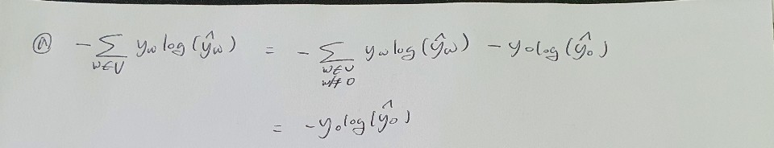
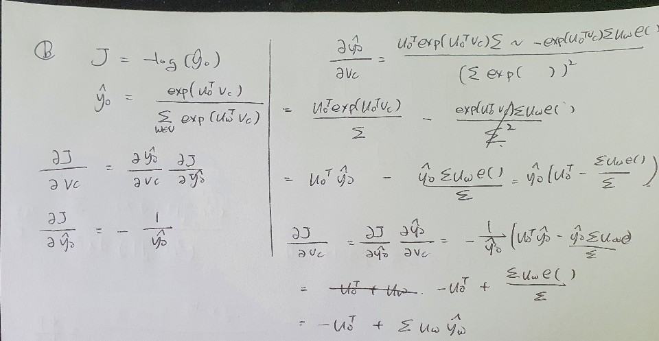
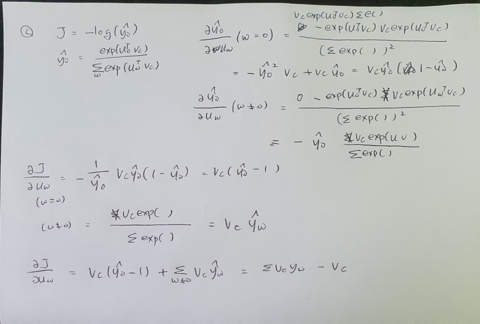
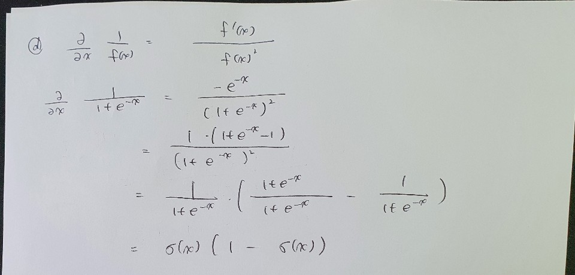
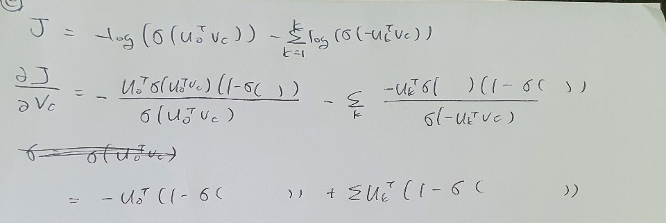
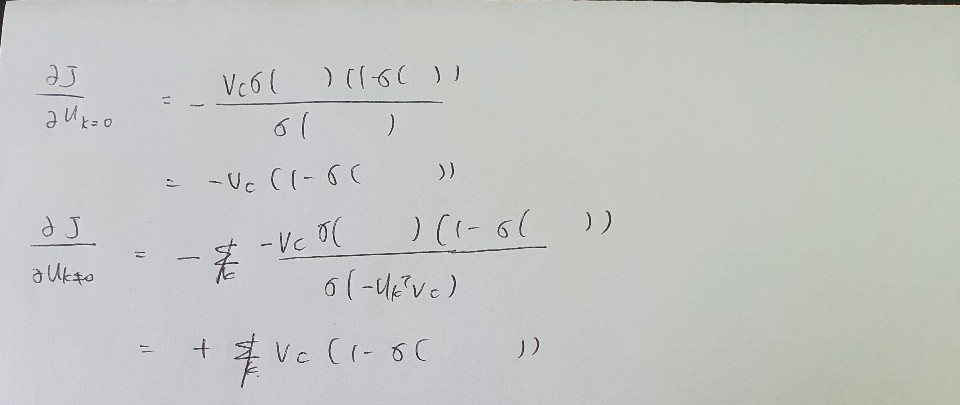
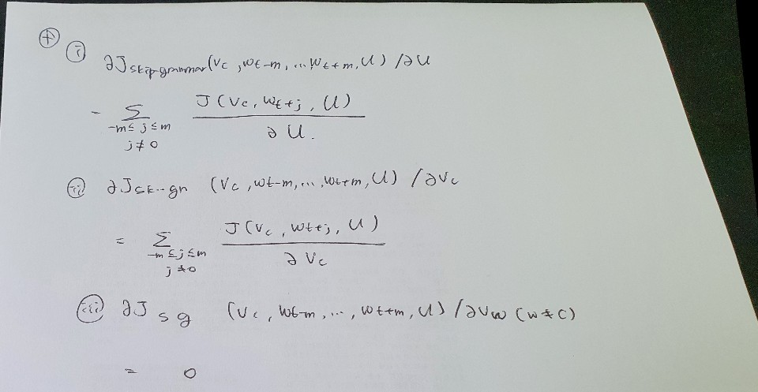

# S2 Assignment

## Written

- a

- b

- c

- d

- e


- a


## Result

```python
python run.py
iter 10: 19.061546
iter 20: 19.114918
iter 30: 19.287617
iter 40: 19.352559
iter 50: 19.559119
...
iter 39970: 9.776979
iter 39980: 9.813174
iter 39990: 9.854022
iter 40000: 9.812206
sanity check: cost at convergence should be around or below 10
training took 4513 seconds
```


